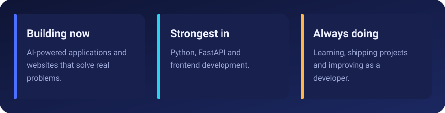
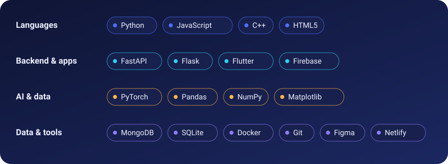

  

  

  

### Things I've built

| Project | What it does | Focus |
| --- | --- | --- |
| [**Ai_Mentor**](https://github.com/Deepak3699/Ai_Mentor) | AI-powered learning management system with courses, analytics, community discussions and AI-generated video lessons | Web + AI |
| [**SMS_spam_detector**](https://github.com/Deepak3699/SMS_spam_detector) | Classifies SMS messages with ML and serves real-time predictions through FastAPI | ML + API |
| [**Data_analytics_tasks**](https://github.com/Deepak3699/Data_analytics_tasks) | Daily documentation and projects from my Data Analytics internship | Data |
| [**Fireworks**](https://github.com/Deepak3699/Fireworks) | A web idea to make Diwali eco-friendly | Frontend |

  
  

  

  <a href="https://instagram.com/btwitsdeep7172">Instagram</a> ·
  <a href="https://www.linkedin.com/in/deepak-khuttan-3b4a29316">LinkedIn</a> ·
  <a href="https://facebook.com/itsDeep7172">Facebook</a> ·
  <a href="mailto:deepakkhuttan65@gmail.com">Email</a>

